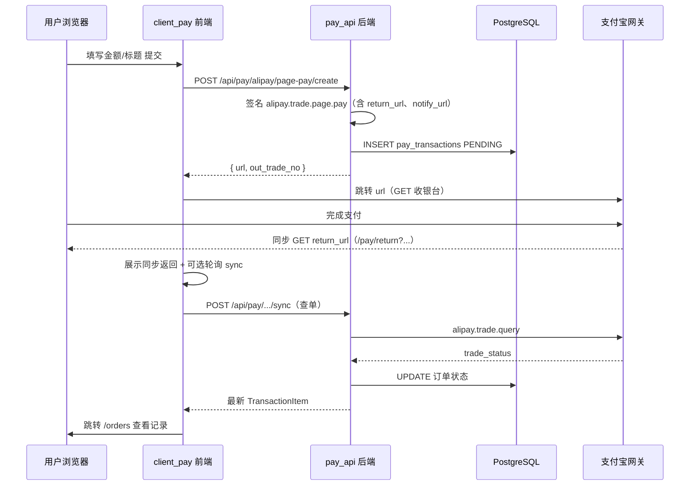
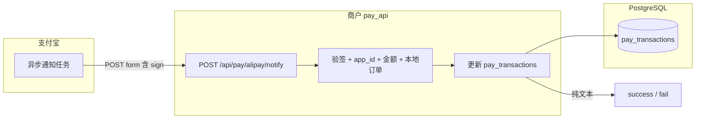
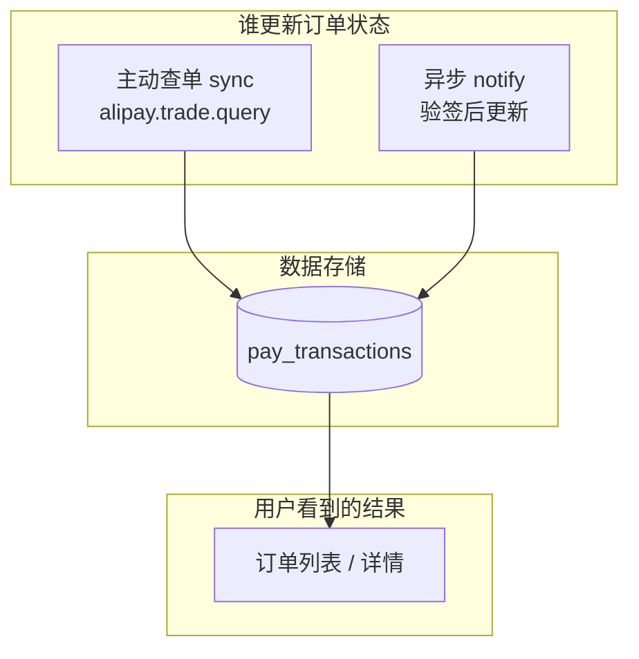

# 支付宝网页支付示例（pay_zhifubao）

基于 **FastAPI + PostgreSQL** 的后端与 **Vite + React** 的前端示例：完成「电脑网站支付」下单、签名跳转、订单落库、**异步通知（notify）** 更新状态，以及 **同步回跳（return_url）** 与 **主动查单（trade.query）** 的体验补偿。

---

## 仓库结构

| 路径 | 说明 |
| --- | --- |
| `pay_api/` | 后端：路由、支付宝 SDK 封装、异步通知验签、订单仓储、配置与迁移 |
| `client_pay/` | 前端：收银台、订单列表、同步返回页、调用后端 API |
| `docs/前端对接API.md` | HTTP 接口说明（含前端与 notify 的配合方式） |
| `docs/支付宝网页支付需求说明.md` | 业务与风控层面的需求说明 |

---

## 核心代码职责

| 模块 | 文件 | 职责 |
| --- | --- | --- |
| 入口 | `pay_api/main.py` | FastAPI 应用、CORS、`/api` 路由前缀、数据库连接生命周期 |
| 路由 | `pay_api/routes.py` | 创建支付、订单 CRUD、查单同步、**notify 入口**、健康检查 |
| 支付宝网关 | `pay_api/alipay_service.py` | 组装 `alipay.trade.page.pay`（含 `return_url` / `notify_url`）、`alipay.trade.query`、状态映射 |
| 异步通知 | `pay_api/alipay_notify.py` | 验签、`app_id`/金额/订单校验、幂等更新 `pay_transactions` |
| 订单数据 | `pay_api/trade_repository.py` | asyncpg 读写 `pay_transactions` |
| 配置 | `pay_api/settings.py` | `.env`：AppId、密钥、沙箱网关、`ALIPAY_RETURN_URL`、`ALIPAY_NOTIFY_URL`、`PUBLIC_API_BASE_URL`、`CORS_ORIGINS` 等 |
| 密钥格式 | `pay_api/key_util.py` | 私钥/支付宝公钥规范化，应用公私钥对校验 |
| 前端 API | `client_pay/src/api/pay.ts` | `fetch` 封装创建支付、订单列表、详情、**sync 查单** |
| 跳转支付宝 | `client_pay/src/lib/alipayRedirect.ts` | `window.location` 打开签名 URL 或提交 `form_html` |

---

## 支付逻辑说明（文字）

1. **创建支付**  
   前端 `POST /api/pay/alipay/page-pay/create` 提交商品标题、金额（及可选 `out_trade_no`）。  
   后端生成或使用传入的 `out_trade_no`，调用 `build_page_pay_get_url`：使用应用私钥签名，向请求中写入 **`return_url`**（用户支付完成后浏览器跳回商户前端）、**`notify_url`**（支付结果由支付宝服务器 POST 到商户后端）。  
   随后在 PostgreSQL 插入一条 **`PENDING`** 订单（与支付宝请求一致）。

2. **用户支付**  
   前端拿到 `url`（或 `form_html`）后整页跳转到 **支付宝收银台**；用户在支付宝侧完成付款。

3. **同步回跳 `return_url`**  
   支付宝将浏览器 **GET** 重定向到商户配置的地址（示例：`/pay/return`）。  
   **该回跳仅用于体验与携带部分参数，不能作为「已支付」的唯一依据。**

4. **异步通知 `notify_url`（权威之一）**  
   支付宝以 **`application/x-www-form-urlencoded`** **POST** `notify_url`。  
   后端 `handle_alipay_async_notify`：**支付宝公钥验签** → 校验 `app_id`、`out_trade_no` 本地存在、`total_amount` 与库一致 → 按 `trade_status` 映射更新为 **`PAID` / `CLOSED` / `PENDING`** 等。  
   响应体必须为纯文本 **`success`** 或 **`fail`**（验签/业务失败可返回 `fail` 触发支付宝重试策略）。

5. **主动查单 `alipay.trade.query`（补偿）**  
   前端在用户回到 **`/pay/return`** 时，若 URL 带有 **`out_trade_no`**，可轮询调用 **`POST /api/pay/orders/{out_trade_no}/sync`**（本仓库已实现），在 notify 尚未到达时尽快刷新列表展示。  
   订单列表页亦可手动点「同步状态」。  
   **浏览器不应直接调用 `POST /api/pay/alipay/notify`**（无合法签名，且架构上应由支付宝服务端调用）。

6. **状态映射**（`map_alipay_trade_status_to_internal`）  
   `TRADE_SUCCESS` / `TRADE_FINISHED` → `PAID`；`WAIT_BUYER_PAY` → `PENDING`；`TRADE_CLOSED` → `CLOSED`。

---

## 流程图

### 1. 用户支付主路径（前端 + 后端 + 支付宝）

### 2. 异步通知（支付宝 → 商户后端，与浏览器并行）

### 3. 订单状态与数据来源（概念）

---

## 快速运行（摘要）

| 组件 | 命令 / 说明 |
| --- | --- |
| 后端 | 进入 `pay_api/`，复制 `.env.example` 为 `.env` 并填写支付宝与 `DATABASE_URL`；执行 `uv sync` 后 `uv run serve` |
| 前端 | 进入 `client_pay/`，`npm install` 后 `npm run dev`；按需配置 `VITE_API_BASE_URL` 或使用 Vite 代理到 `8000` |
| 异步通知联调 | `notify_url` 须 **公网 HTTPS**；可配置 `ALIPAY_NOTIFY_URL` 或 `PUBLIC_API_BASE_URL`（自动拼接 `/api/pay/alipay/notify`），详见 `pay_api/.env.example` |

更细的接口字段与前端配合说明见 **[docs/前端对接API.md](docs/前端对接API.md)**。

---

## 文档与约定

- **接口契约**：`docs/前端对接API.md`
- **业务与合规注意点**：`docs/支付宝网页支付需求说明.md`
- **Git 提交信息**：仓库约定使用中文 Conventional Commits（若你为本仓库贡献代码）。

---

## 技术栈一览

- **后端**：Python 3.12+、FastAPI、uvicorn、asyncpg、SQLAlchemy/Alembic、`alipay-sdk-python`、Pydantic Settings  
- **前端**：React、TypeScript、Vite、Ant Design、React Router  
- **数据库**：PostgreSQL（表 `pay_transactions`）
